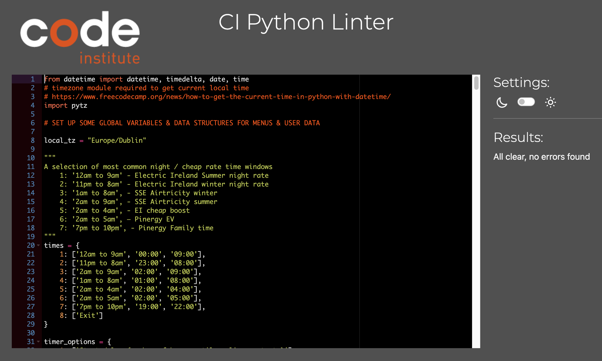

# Time Lord

Time Lord is a little python console application designed to help save money by making it easier to time shift usage of  energy intensive appliances to avail of lower night rate electricity charges. 

[Run the live deployed app here](https://time-lord-bristlebird-f6d274971209.herokuapp.com/)

## Table of contents

1. [Pre-Project Planning](#planning)
1. [User Flow](#user-flow)
1. [Application Flow](#app-flow)
1. [Future Features](#future-features)
1. [Technologies used](#technologies)
1. [Testing](#testing)
1. [Deployment](#deployment)
1. [Resources](#resources)
1. [Acknowledgements](#acknowledgements)

## Pre project planning

### Background

Many modern household appliances such as dishwashers, washing machines, ovens, bread-makers, yogurt makers and so forth,  come with a time delay function, allowing you to set them to run at a time that best suits your lifestyle, daily routine and budget. Most electricity supply companies offer night rate and smart meter plans that have lower rates at certain times, so you can save money by time-shifting your energy intensive appliances so that use power charged at the lower rate. 

Attaining any cost-saving from these kind of plans requires a good handle on how to time shift your appliances. Here lies...

### The Problem

Unless all your appliances are made by the same high end manufacturer, it's more than likely that their time shifting functions will behave differently and require different timing inputs to work at the optimal time. Working out the different time offsets for all these appliances at the end of long day can become tiresome and confusing!

Luckily... Time lord is here to help!

In some cases you'll want a cycle to finish at a certain time: bread, for example, should be taken out of a bread maker as soon as it's ready as it goes soggy if left in for long after — this usually means as soon as you get up in the morning. In other cases, you just want the appliance to start when the cheap night rate kicks in, or at least to be finished by the time the more expensive day rate kicks in.

In most cases, an appliance will have several different cycles of varying durations, and turn themselves off automatically when the cycle is complete, so you'll usually need to know what the cycle duration is — this is usually displayed on the appliance when the cycle is selected. Sometimes you'll have to set your own 'cooking time / duration' in addition to setting a start time or onset delay.

### Target Audience
Homeowners, parents, renters — essentially anyone who's involved in running and financing the domestic side of a household.

### The Solution

The objective is to run appliances at cheaper night rate & to help you set your appliance timers so that they run at the best and most cost effective time. Based on your low rate time window, the appliance's cycle duration, when you'd like it to end, Time Lord will do all the tricky time based maths and tell you what the best time or delay value to set the timer with, depending on the required input.

## User flow

1. User is asked to chose their night rate hours (11pm - 8am / 12am - 9am / 1am - 8am / 2am - 9am) — these may differ depending on the supplier.
2. User is asked to select appliance from list (washing machine, dishwasher, bread oven, cooker, yogurt maker, etc)
3. User is asked to how their appliance timer works to determine what input is required — choose  from list of timer input options:
	* Start delay (hours until appliance starts)
	* End delay (hours until appliance cycle ends)
	* Start time 
	* End time
4. User is asked to enter cycle duration / cooking time?
5. User is asked if they would you like the appliance to finish at a specific time? i.e. bread may need to finish baking at 6.30am 

### Timer input options
The app calculates output values for each of the following input options.

1. **Start Delay** — could just be the number of hours 'til the low rate kicks in, or if a preferred end time is set, it'll work back from that taking in the cycle duration, but also recommending an alternative to fit the cycle within the low rate time window. 
1. **End Delay** — again could just be the cycle duration + the no. of hours 'til the low rate kicks in, or until a preferred end time.
3. **Start time** — make a recommendation based on time night time starts, or use cycle duration to calculate start time from the preferred end time, and suggest time to fit low rate.
4. **End time** — just use preferred end time if set & suggest end time to fall within the low rate window if the preferred time doesn't.

## Application Flow
### Step 1 - Select the low rate time window (required)

### Step 2 - Select an appliance (required)

### Step 3 - Select the required timer input option (required)

### Step 4 - Enter the appliances cycle duration (required)

### Step 5 - Enter a preferred end time (optional)

### Result (& start again / set another appliance timer)

## Future features
- Add a timer input option for start delay + end time (some Bosch ovens)
- Option to save the settings for each appliance in a Google sheet so it can be quickly recalled next time. These settings would be unique to each individual to it would also require secure user authentication. 
- Code refactors: create a separate compute output function for each timer input option.
- Tell user if appliance's complete cycle falls within low rate window, if it doesn't tell them how much falls outside.
- Display potential cost savings per program, per week / month / year based on actual cost per Kw/h or based on current average rates.
- Build out a responsive progressive web app version to make it more accessible and useful!

## Technologies Used
1. [Python](https://www.python.org/) — for the main application logic
2. Python modules / libraries:
	- [datetime module](https://docs.python.org/3/library/datetime.html)  - used in the calculation and manipulation of dates and times
	- [pytz library](https://pypi.org/project/pytz/) - used set correct timezone location  
3. [Heroku](https://dashboard.heroku.com/) — for app deplyment & hosting
4. [Git](https://git-scm.com/) — for version control
5. [Github](https://github.com/bristlebird/time-lord) — for code storage / this repository
6. [Gitpod](https://gitpod.io/) — IDE used to write the code
7. [Visual Studio Code for Mac](https://code.visualstudio.com/) — IDE also used to write code (connected to Gitpod Workspace)
8. [Code Institute's Python essentials template](https://github.com/Code-Institute-Org/python-essentials-template)
9. [Macdown](https://macdown.uranusjr.com/) — open source Markdown editor for macOS, used to create this README
10. [Lucid Charts](https://lucid.app/) — used to create flowchart

##  Deployment Procedure
This python was deployed on Heroku — [view the live app here](https://time-lord-bristlebird-f6d274971209.herokuapp.com/). 

If you want to fork this project and deploy this app on Heroku, you can follow these 10 steps:

1. Ensure that the project requirements.txt has been generated by running the following command in the terminal from the application root folder `pip3 freeze > requirements.txt` (some dependencies were installed that were not required in the end, such as gspread and google-auth, so these could be ommitted from the requirements.txt file).
2. If you don't already have one, set up a free account [here](https://signup.heroku.com/).
3.  When creating the account, you can choose the country you're in, set Python as the primary development language, set your password & agree to their terms of service.
4. When you've created your account & logged in, hit the 'Create new app' button in the dashboard.
5. Give the app a unique name & select your region & hit 'Create app' button.
6. Once the app is created, hit the 'Settings' tab, hit 'Add buildpack', select Python & save changes, then hit 'Add buildpack' again, select Nodejs & save changes. Ensure Python is first in the list and Nodejs second by re-ordering if necessary.
7. Next hit the 'Deploy' tab and select 'Github' in the Deployment method section, then hit the 'Connect to Github' button. You'll need to be logged in to Github to authorise this connection.
8. Once Github is connected, enter the repository name in the 'Search for a repository to connect to' field, hit the 'search' button then hit the 'Connect' button for the chosen repository.
9. You can then either enable automatic deployment or deploy manually — to deploy manually, select the branch to deploy (probably 'main'), the hit the 'Deploy branch' button.
10. Once the app has been successfully deployed you can click the 'View' button to open the deployed app in your browser.

## Testing

### Manual Tests

| Test | Result |
| -- | -- |
| User prompted with step 1 menu choice after intro message | Pass |
| Confirmation of low rate window selection printed to screen | Pass |
| Confirmation of appliance selection printed to screen | Pass |
| Confirmation of timer input selection printed to screen | Pass |
| Confirmation of appliance running time entered printed to screen | Pass |
| Calculated result printed to screen | Pass |
| Correct start delay when current time within low rate window that doesn't span midnight  | Pass |
| Correct start delay when current time within low rate window that doesn't span midnight, end time set  | Pass |
| Correct start delay when current time within low rate window that does span midnight  | Fail |
| Correct start delay when current time within low rate window that does span midnight, end time set  | Pass |
| Correct start delay when current time not within low rate window that doesn't span midnight | Pass |
| Correct start delay when current time not within low rate window that doesn't span midnight, end time set  | Pass |
| Correct end delay when current time within low rate window that doesn't span midnight  | Pass |
| Correct end delay when current time within low rate window that doesn't span midnight, end time set  | Pass |
| Correct end delay when current time within low rate window that does span midnight  | Fail |
| Correct end delay when current time within low rate window that does span midnight, end time set  | Pass |
| Correct end delay when current time not within low rate window that doesn't span midnight | Pass |
| Correct end delay when current time not within low rate window that doesn't span midnight, end time set  | Pass |
| Correct start time when current time within low rate window that doesn't span midnight  | Pass |
| Correct start time when current time within low rate window that doesn't span midnight, end time set  | Pass |
| Correct start time when current time within low rate window that does span midnight  | Pass |
| Correct start time when current time within low rate window that does span midnight, end time set  | Pass |
| Correct start time when current time not within low rate window that doesn't span midnight | Pass |
| Correct start time when current time not within low rate window that doesn't span midnight, end time set  | Pass |
| Correct start time warning / suggestion when current time within low rate window that does span midnight, end time set to after low rate end  | Fail |
| Correct start time warning / suggestion when current time not within low rate window that doesn't span midnight, end time set to after low rate end  | Pass |
| Correct end time when current time within low rate window that doesn't span midnight  | Pass |
| Correct end time when current time within low rate window that doesn't span midnight, end time set  | Pass |
| Correct end time when current time within low rate window that does span midnight  | Pass |
| Correct end time when current time within low rate window that does span midnight, end time set  | Pass |
| Correct end time when current time not within low rate window that doesn't span midnight | Pass |
| Correct start time when current time not within low rate window that doesn't span midnight, end time set  | Pass |

### Error handling tests

Validation errors were handled and messages explicitly output when incorrect data was entered:
- Error message for non integer entry to menu selection: 'Wrong input. Please enter a number ...'
- Error message for integer out of range of menu selection: 'Invalid option. Please enter a number between 1 and (length of menu)'
- Error message when invalid time format entered: 'Invalid data {e}, please try again'

| Test | Result |
| -- | -- |
| Menu selection: User enters empty string | Pass |
| Menu selection: User enters number out of range | Pass |
| Menu selection: User enters any random letters | Pass |
| Time entry: User enters empty string | Pass |
| Time entry: User enters numbers out of range | Pass |
| Time entry: User enters numbers with incorrect delimiter(:) | Pass |
| Time entry: User enters any random letters | Pass |

### Bugs
1. When the current time is within a low rate window that spans midnight, i.e. 11pm - 8am, the output of the start delay and end delay calculations are incorrect. The result should be zero (i.e. start now) if the majority of the cycle would complete within the low rate time window. Actual result is no. of hours until the next low rate window starts (it's shifted a day ahead).
2. Incorrect suggestion given when current time within low rate window that does span midnight and end time set to after low rate end. 

### Pep8 Code Linter
[Code Institute's Pep8 Python Linter](https://pep8ci.herokuapp.com/) was used to correctly format python code and ensure it was free from errors:

## Resources

- Python docs: [datetime module](https://docs.python.org/3/library/datetime.html) 
- Real Python: [Using Python datetime to Work With Dates and Times](https://realpython.com/python-datetime/)
- Computing Learner: [How to create a menu for a python console application](https://computinglearner.com/how-to-create-a-menu-for-a-python-console-application/) 
- Stackoverflow: 
	- [Time input validation in python](https://stackoverflow.com/questions/33076617/how-to-validate-time-format)
	- [Get duration between 2 python datetime objects](https://stackoverflow.com/questions/43305577/python-calculate-the-difference-between-two-datetime-time-objects) 
- Code Institute: [Alan Bushell's Blackjack project Readme structure](https://github.com/Alan-Bushell/blackjack/)
- FreeCodeCamp: [timezone module required to get current local time](https://www.freecodecamp.org/news/how-to-get-the-current-time-in-python-with-datetime/)

## Acknowledgements
- [Alan Bushell](https://github.com/Alan-Bushell): CI mentor for guiding me wisely & providing great encouragement throughout the project.
- [Amy Richardson](https://github.com/amylour/): CI cohort supervisor for her endless  encouragement, optimism and enthusiam on our weekly standups.